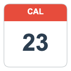

# Smart Calendar - StreamDock Plugin

A StreamDock plugin that displays the current date dynamically and allows opening web calendar services with a single click.



## Features

- **Dynamic Calendar**: Shows the current date that updates automatically every minute
- **Attractive Visual Design**: Calendar interface with rounded corners, red header for the month, and highlighted day number
- **Multiple Calendar Services**: Built-in support for various popular web services
- **Simple Configuration**: Intuitive configuration interface with real-time preview
- **Multi-language**: Support for English and Simplified Chinese

## Supported Calendar Services

### Web Calendars
- **Google Calendar** - https://calendar.google.com/
- **Outlook Calendar** - https://outlook.com/calendar
- **iCloud Calendar** - https://www.icloud.com/calendar
- **Yahoo Calendar** - https://calendar.yahoo.com/
- **Notion Calendar** - https://www.notion.so/calendar

### Task Management
- **Todoist** - https://todoist.com/app
- **Any.do** - https://app.any.do/
- **TickTick** - https://www.ticktick.com/webapp/

### Custom URL
You can also configure any custom web URL.

## Installation

1. Download the `.streamDockPlugin` file
2. Double-click to install it in StreamDock
3. The plugin will appear in the "Smart Calendar" category

## Configuration

1. Drag the Smart Calendar plugin to your StreamDock
2. In the property inspector, select your preferred calendar service
3. Or enter a custom URL if you prefer another service
4. The preview will show you how the button will look

## Usage

- **Display**: The button shows the current date (day and month) that updates automatically
- **Click**: Pressing the button opens your configured calendar service in the web browser

## Security Limitations

Due to StreamDock security limitations, plugins can only open web URLs. Local applications cannot be opened directly from plugins.

## Technical Specifications

- **Version**: 1.0.0
- **Compatibility**: 
  - macOS 10.11 or higher
  - Windows 7 or higher
- **StreamDock**: Minimum version 2.9
- **Supported Controllers**: Keypad, Information

## Project Structure

```
com.orumad.streamdock.smartcalendar.sdPlugin/
├── manifest.json              # Plugin configuration
├── plugin/
│   ├── index.js              # Main calendar logic
│   ├── index.html            # Main plugin page
│   └── utils/
│       ├── common.js         # StreamDock base framework
│       ├── worker.js         # Timer management
│       └── axios.js          # HTTP library
├── propertyInspector/
│   └── action1/
│       ├── index.html        # Configuration interface
│       └── index.js          # Configuration logic
├── static/
│   ├── smartcalendar-icon.png # Plugin icon
│   └── css/
│       └── sdpi.css          # Interface styles
├── en.json                   # English translations
└── zh_CN.json               # Chinese translations
```

## Development

The plugin is developed with:
- **JavaScript ES6+**: Main logic
- **HTML5 Canvas**: Calendar rendering
- **WebSocket**: StreamDock communication
- **Web Workers**: Timer management

## Author

Developed by **Orumad**
- GitHub: https://github.com/orumad

## License

This plugin is open source. See the [LICENSE.md](LICENSE.md) file for details.